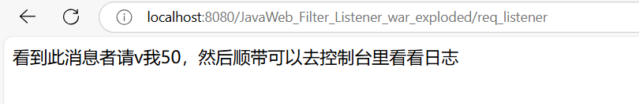
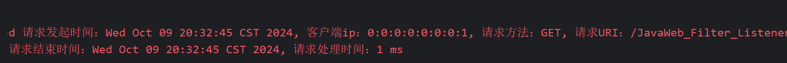
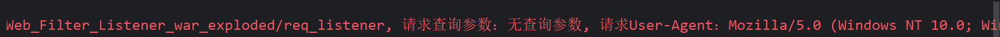

# 第四章作业二——Listener练习

注意：

1·由于Listener和Filter被我放在一个项目，所以我把本次作业测试用Servlet，即TestRequestListener的对应相对路径"/req_listener"加入了排除路径。

2·不算难，不写注释了

创建日志

```java
//Logger.getLogger 方法用于获取或创建日志
    private static final Logger logger = Logger.getLogger("RequestLogger");
```

重写requestInitialized 

拿到时间

```java
Date reqStartDate = new Date();
long reqStartTime = System.currentTimeMillis();
```

放进request对象

```java
req.setAttribute("reqStartDate", reqStartDate);
req.setAttribute("reqStartTime", reqStartTime);
```

然后加上需要记录的属性

```java
String reqIp = req.getRemoteAddr();
String reqMethod = req.getMethod();
String reqUri = req.getRequestURI();
String reqQueryString = req.getQueryString() != null ? req.getQueryString() : "无查询参数";
String reqUserAgent = req.getHeader("User-Agent");
System.out.println("目前的请求开始的时间为 " + reqStartDate);
```

输出创建request请求时的信息日志

```java
logger.info(String.format("请求发起时间：%s, 客户端ip：%s, 请求方法：%s, 请求URI：%s, 请求查询参数：%s, 请求User-Agent：%s",
        reqStartDate, reqIp, reqMethod, reqUri, reqQueryString, reqUserAgent));
```

重写requestDestroyed方法

拿到之前放进request对象的时间属性

```java
Date reqStartDate = (Date) req.getAttribute("reqStartDate");
long reqStartTime = (Long) req.getAttribute("reqStartTime");
```

拿到当前（销毁）时的时间，并计算处理时间

```java
Date reqDiedDate = new Date();
long reqDiedTime = System.currentTimeMillis();
long reqLifeTime = reqDiedTime - reqStartTime;
```

输出对应信息

```java
logger.info(String.format("请求结束时间：%s, 请求处理时间：%d ms",
        reqDiedDate, reqLifeTime));
```

截图演示：








